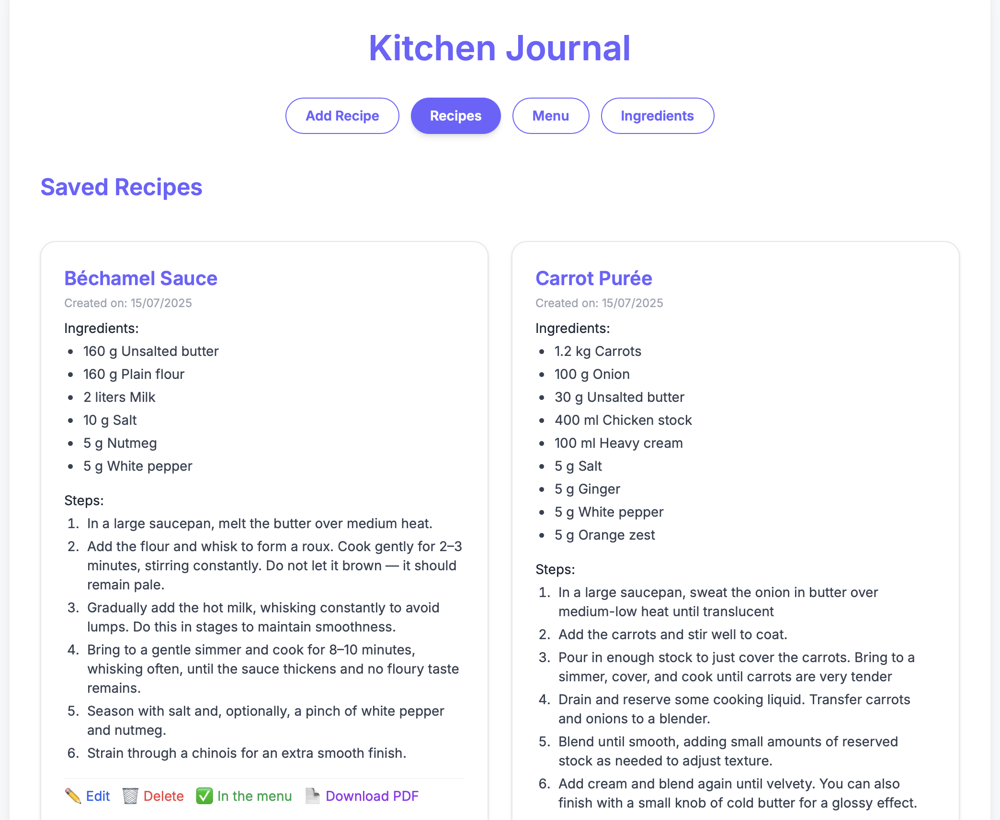
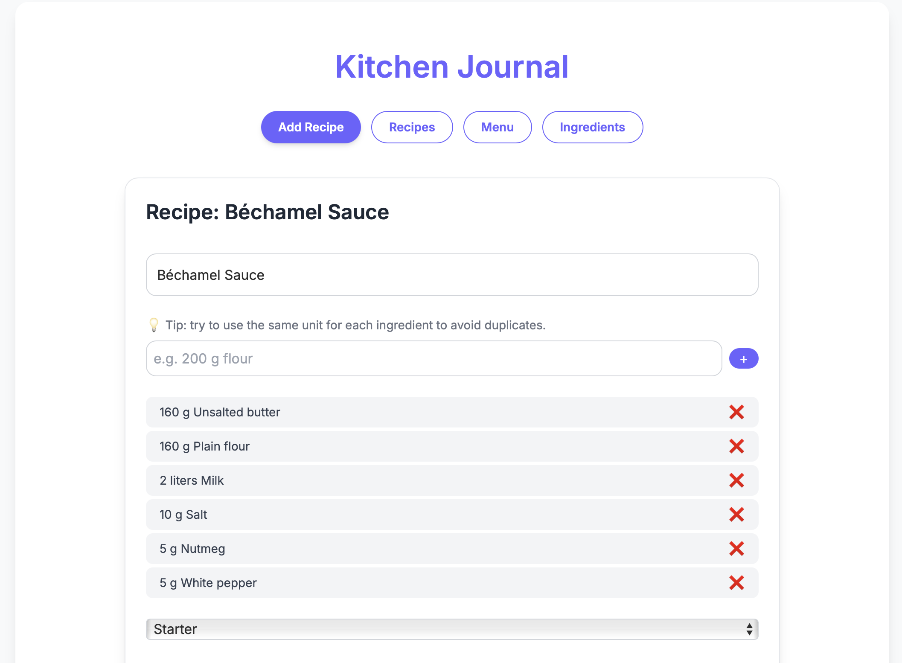
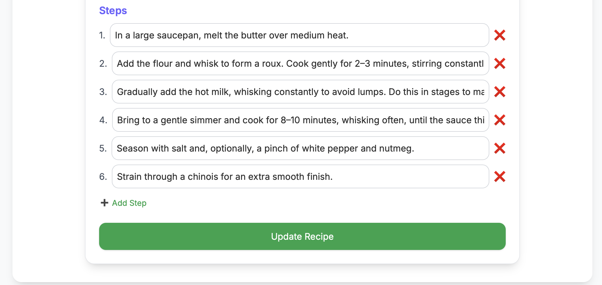
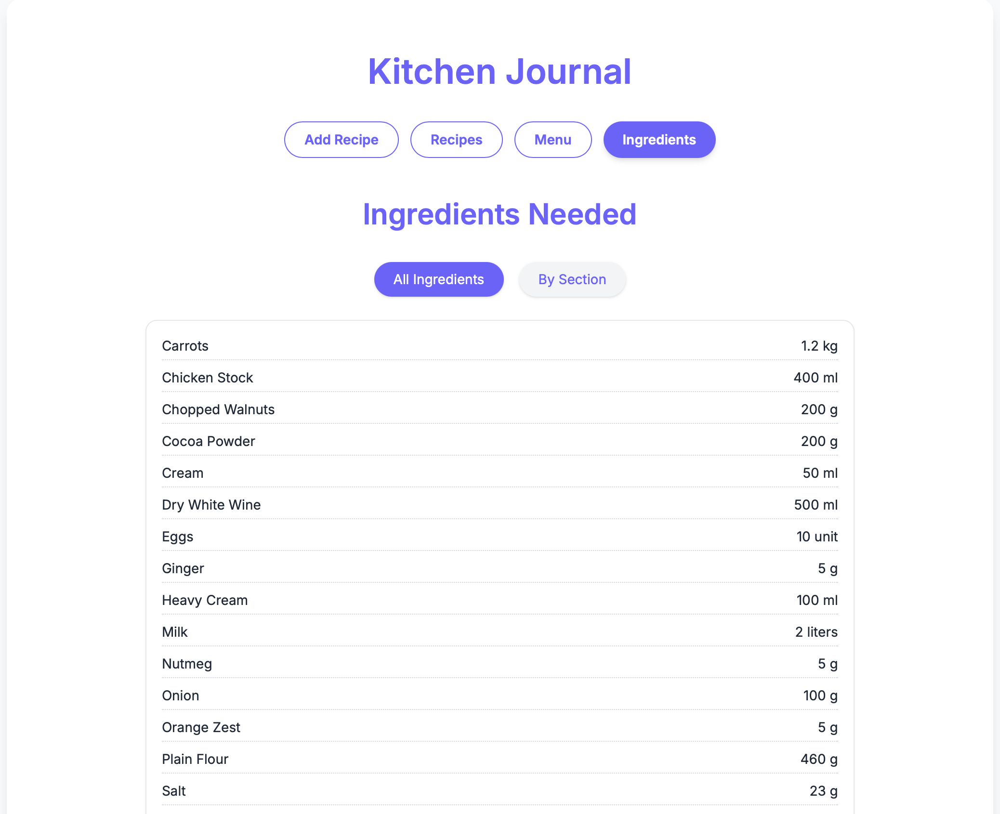
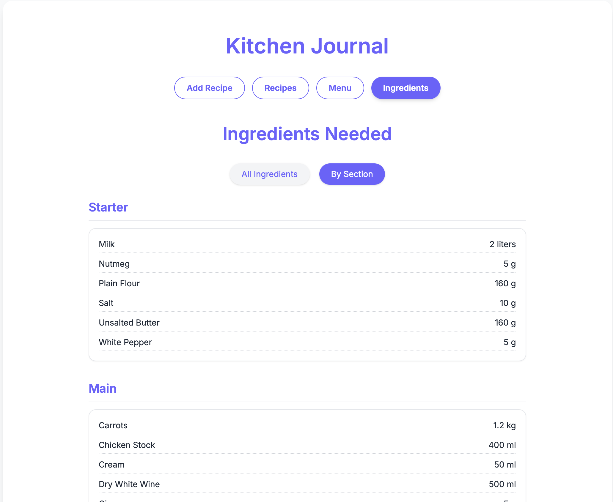
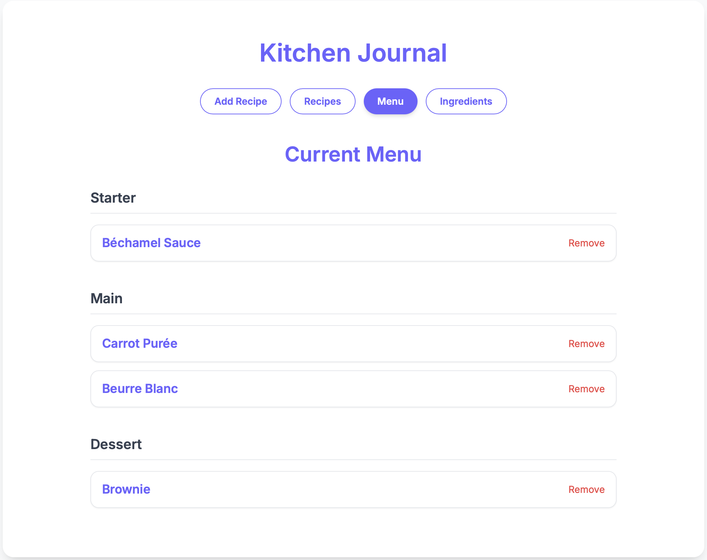
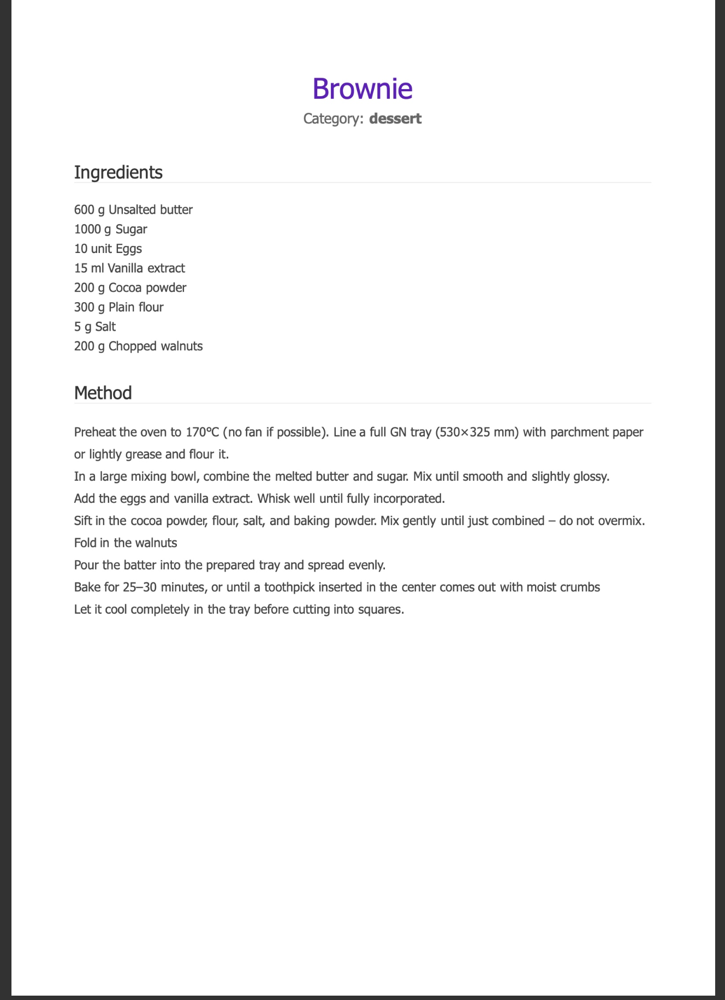

# 🍽️ Kitchen Journal

**Kitchen Journal** is a modern and minimalistic web app for chefs to manage recipes, plan menus, and keep track of ingredients in a professional kitchen environment.

Built with React and TailwindCSS, it helps streamline kitchen workflows, supports large-batch recipes with accurate units (grams, ml), and adapts well to restaurant or catering settings.

---

## ✨ Features

- Add, edit and organize recipes with ingredients and preparation steps  
- Categorize recipes as starter, main or dessert  
- Automatically generate an ingredient list from selected menu recipes  
- Responsive interface using React + TailwindCSS  
- Simple local state management (no database or backend required)  

---

## 🚀 Getting Started

### 1. Clone the repository

```bash
git clone https://github.com/yourusername/kitchen-journal.git
cd kitchen-journal
```

### 2. Install dependencies

```bash
npm install
```

### 3. Start the development server

```bash
npm run dev
```

Open your browser at: [http://localhost:5173](http://localhost:5173)

---

## 🧠 Tech Stack

- [React](https://react.dev/)
- [Vite](https://vitejs.dev/)
- [TailwindCSS](https://tailwindcss.com/)
- JavaScript (ES6+)

---

## 📁 Project Structure

```
src/
├── components/       # UI components (buttons, forms, etc.)
├── pages/            # Pages: Recipes, Menu, Ingredients
├── data/             # App state (recipes, menu, etc.)
├── App.jsx           # Main layout and router
└── index.css         # TailwindCSS setup
```

---

## 🛠 Planned Features

- Ingredient stock control  
- Tags or allergens filters  
- Import/export recipe data  
- PDF or print mode for kitchen use  
- Seasonal ingredient suggestions  

---

## 📸 Screenshots

### Recipe Section


### Add Recipe Form


### Edit Recipe


### Ingredients View


### Ingredients by Section


### Menu Section


### Downloaded Recipe View (PDF)



---

## 🧑‍🍳 Created by

**Antonella Imarisio** – [@An-im](https://github.com/An-im)  
Chef & developer, passionate about food tech & kitchen workflows.

---

## 📄 License

This project is licensed under the **MIT License**.
